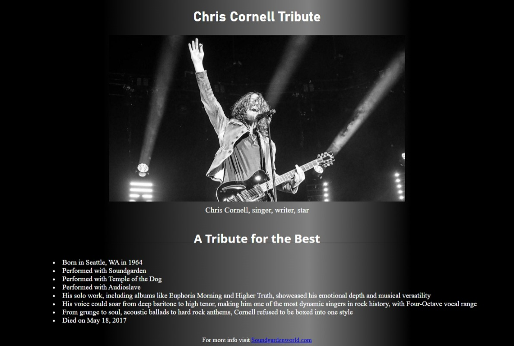

# Chris Cornell Tribute

A tribute page dedicated to the legendary musician Chris Cornell.  
This project is part of the **Responsive Web Design Certification** from [freeCodeCamp](https://www.freecodecamp.org/).

## 🎸 Live Demo

[View the live site here](https://jesusesp85.github.io/Chris-Cornell-Tribute/)  

## 🛠️ Technologies Used

- HTML5
- CSS3

## 📌 Project Description

This tribute page honors the life and legacy of Chris Cornell, featuring:

- A picture of the artist
- A list of his most iconic bands
- A clean, responsive layout

## 📁 Project Structure

## 📸 Screenshot

  

## 🧠 What I Learned

- Structuring semantic HTML
- Styling with CSS Flexbox and media queries
- Organizing assets and maintaining clean code

## 📬 Contact

Feel free to reach out if you have feedback or suggestions.  
[Jesusesp85]

---

